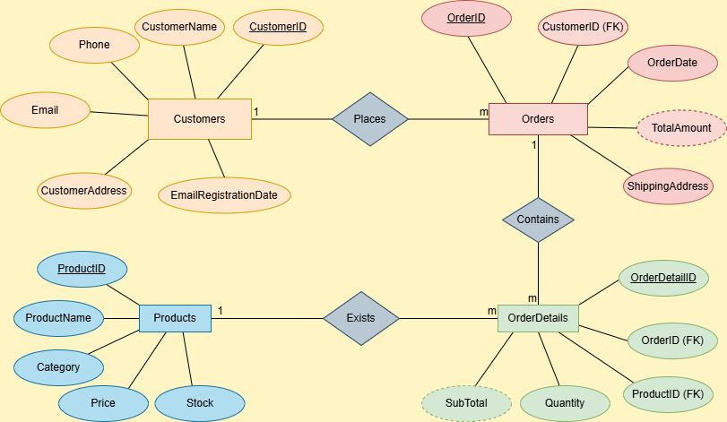

### Entities

- An entity is an object or thing in the real world that has a distinct existence and is relevant to a database.
- An entity is usually represented by a table in a relational database.
- For example, in a university database, an entity could be a Student or a Course. Each student or course represents a specific entity.

### Attributes

- Attributes are the characteristics or properties that describe an entity.
- In a database, attributes are represented by the columns in a table.
- For example, a Student entity might have attributes like Student ID, Name, Date of Birth, and Address.
- Each of these attributes provides more information about the student entity.

### Relationships

- A relationship represents how entities are related or associated with each other. In relational databases, this is typically represented by foreign keys or associative tables.
- Relationships can be categorized by their cardinality, such as:
  - One-to-One (1:1): One entity instance is related to one other entity instance. For example, one Student has one Student ID.
  - One-to-Many (1:N): One entity instance is related to many other instances. For example, one Professor teaches many Courses.
  - Many-to-Many (M:N): Many instances of one entity are related to many instances of another. For example, many Students can enroll in many Courses.

### Normalization

- Normalization is the process of organizing the data in the database to reduce redundancy and dependency. The goal is to minimize the chances of anomalies during data operations (like insertions, updates, and deletions).
- This is done by dividing large tables into smaller, related ones and ensuring each table contains data about one thing.
- There are normal forms (1NF, 2NF, 3NF, etc.) that set the rules for structuring tables:
  - 1st Normal Form (1NF): Ensures that each column contains only atomic values (no repeating groups).
  - 2nd Normal Form (2NF): Achieves 1NF and removes partial dependencies (attributes that depend on only part of a composite primary key).
  - 3rd Normal Form (3NF): Achieves 2NF and removes transitive dependencies (attributes that depend on other non-key attributes).
  - Higher normal forms (BCNF, 4NF, etc.) further refine these concepts, but 3NF is typically sufficient for most practical database designs.
